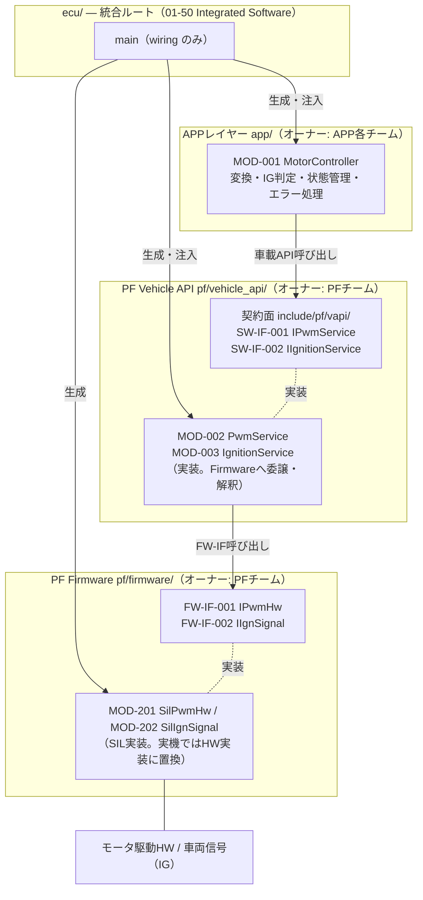
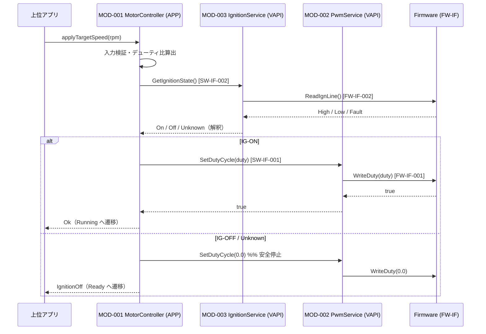

# SWアーキテクチャ設計書（SW Architectural Design）

> **成果物ID:** 04-04 SW Architectural Design
> **参照プロセス:** SWE.2 Software Architectural Design
> **注:** 本書は Work Instructions のプロセスを実演するためのサンプル成果物である。

---

## 文書管理情報

| 項目 | 内容 |
|------|------|
| 文書番号 | 04-04-PT01-MOTORCTRL |
| バージョン | v1.1 |
| ステータス | Approved |
| プロジェクト名 | ProcessTest（SWEプロセスサンプル） |
| 対象コンポーネント | モータ制御（PF / APP / ECU 統合構成） |
| 作成者 | Arch |
| 作成日 | 2026-09-28 |
| 承認者 | Arch（Lead） |
| 承認日 | 2026-09-28 |
| 関連GitHub Issue | #3（[SWE.2] MotorControl アーキテクチャ設計） |
| 前工程成果物リンク | [17-11 SW要求仕様書](../requirements/17-11-sw-requirements-specification.md) / [17-50 検証基準](../requirements/17-50-verification-criteria.md) |
| 次工程成果物リンク | [04-05 MOD-001](./04-05-sw-detailed-design.md) / [04-05 PF Vehicle API](./04-05-pf-vehicle-api-detailed-design.md) |

### 改訂履歴

| バージョン | 日付 | 変更内容 | 変更者 | 承認者 |
|-----------|------|---------|-------|-------|
| v1.0 | 2026-09-28 | 初版作成（PF/APP 2レイヤー構成） | Arch | Arch（Lead） |
| v1.1 | 2026-09-28 | PF を Firmware / Vehicle API に分割し、統合ルート（ecu/）を追加した 3 層構成へ再編。fw 隠蔽の強制手段を追加 | Arch | Arch（Lead） |

---

## 1. アーキテクチャ概要

### 1.1 設計方針

本ソフトウェアは **PF（Firmware / Vehicle API）** と **APP** のレイヤーで構成し、**統合ルート（ecu/）** が全レイヤーを合成する。

| 方針 | 内容 |
|------|------|
| 契約面の一元化 | APP に公開する I/F は `pf/vehicle_api/include/pf/vapi/` の**車載 API（抽象 I/F）のみ**とする（17-08 / 17-00-B 対応・Doxygen 契約記述必須） |
| Firmware の隠蔽 | HW 依存部（レジスタ・信号ライン）は Firmware 層に閉じ込め、Vehicle API 実装のみが使用する。APP からは不可視 |
| 依存性注入 | レイヤー間依存はすべてコンストラクタ注入。ユニットテストはモック（vapi_mock / fw_mock）、SIL は Firmware SIL 実装、実機は HAL 実装に差し替える |
| 統合ルートの一元化 | オブジェクトの生成・wiring は ecu/（Composition Root）でのみ行う。統合ルートのみ Firmware 具象に触れてよい |
| フェールセーフ | IG 信号の取得失敗（ライン Fault → Unknown）は IG-OFF と同等に扱い、安全側（出力停止）に倒す |

### 1.2 アーキテクチャ制約と強制手段

| 制約 | 内容 | 強制手段 | 関連要求ID |
|------|------|---------|------------|
| コーディング規約 | AUTOSAR C++14 Guidelines 準拠（例外不使用・動的メモリ確保禁止） | 静的解析（tools/static-analysis/）+ 共通警告フラグ（-Werror） | SW-CON-001 |
| レイヤー間依存方向 | APP → Vehicle API → Firmware の一方向のみ。逆依存禁止 | `scripts/check_layer_deps.sh`（CI 必須ステップ） | SW-CON-004 |
| Firmware ヘッダの非公開 | APP へ Firmware の include パスを伝播させない | ① pf_vapi が pf_fw を **PRIVATE リンク**（CMake） ② vapi 公開ヘッダは fw 型を**前方宣言のみ**で参照 ③ CI の include 検査 | SW-REQ-200/201 |
| レビュー独立性 | レイヤー別のオーナーチームがレビューする | `.github/CODEOWNERS`（pf/** → PF チーム、app/** → APP チーム） | — |
| ビルド構成の固定 | 全員・CI が同一構成でビルドする | `CMakePresets.json` + docker/（SUP.8 管理対象） | — |

---

## 2. SWコンポーネント構成図

> PlantUML 版コンポーネント図: [uml/component-overview.puml](./uml/component-overview.puml)

### 2.1 コンポーネント一覧

| コンポーネントID | コンポーネント名 | 責務 | レイヤー | 配置先 | ASIL | 主なI/F |
|------------------|------------------|------|----------|--------|------|----------|
| COMP-001 | MotorControl | 目標回転数の PWM 変換・IG 判定・状態管理 | Application | Linux（SIL）/ 車載ECU | ASIL-B | SW-IF-001, SW-IF-002（使用） |
| COMP-002 | Vehicle API | 車載 API の契約面提供と実装（Firmware への委譲・信号解釈） | Platform / Middleware | 同上 | ASIL-B | SW-IF-001, SW-IF-002（提供）/ FW-IF-001, 002（使用） |
| COMP-003 | Firmware | HW アクセス（PWM レジスタ・IG 信号ライン） | Platform / Driver | 同上 | ASIL-B（経路） | FW-IF-001, FW-IF-002（提供） |
| COMP-004 | ECU 統合ルート | 全レイヤーの生成・注入（wiring）。01-50 の生成単位 | Integration | 同上 | — | — |

---

## 3. SWモジュール定義

| モジュールID | モジュール名 | 責務 | ASIL | レイヤー | 割り当てSW要求 | 詳細設計 | ステータス |
|-----------|-----------|------|------|----------|--------------|---------|----------|
| MOD-001 | MotorController | 線形変換・入力検証・IG判定・状態管理・エラー処理 | ASIL-B | APP | SW-REQ-001〜005, PWR-001 | [04-05 MOD-001](./04-05-sw-detailed-design.md) | closed |
| MOD-002 | PwmService | SW-IF-001 実装。API 境界の値域検証と Firmware への委譲 | ASIL-B | Vehicle API | SW-REQ-200 | [04-05 PFVAPI](./04-05-pf-vehicle-api-detailed-design.md) | closed |
| MOD-003 | IgnitionService | SW-IF-002 実装。IG 信号ライン状態の車両状態への解釈 | ASIL-B | Vehicle API | SW-REQ-201 | 同上 | closed |
| MOD-201 | SilPwmHw | FW-IF-001 の SIL 実装（レジスタ値域検証・履歴記録・故障注入） | QM（検証用） | Firmware | —（検証系。孤立許容） | — | closed |
| MOD-202 | SilIgnSignal | FW-IF-002 の SIL 実装（ライン状態模擬） | QM（検証用） | Firmware | —（検証系。孤立許容） | — | closed |

---

## 4. インターフェース設計

### 4.1 車載 API（APP への契約面。17-08 / 17-00-B 対応）

| I/F ID | I/F名称 | 提供→使用 | シグネチャ | 参照 SW-REQ | ASIL | 定義ファイル |
|--------|----------|-----------|-----------|-------------|------|-------------|
| SW-IF-001 | PWM出力サービス | Vehicle API → APP | `bool pf::vapi::IPwmService::SetDutyCycle(float dutyCyclePercent)`（Range: 0.0〜100.0 %） | SW-REQ-200 | ASIL-B | `pf/vehicle_api/include/pf/vapi/i_pwm_service.hpp` |
| SW-IF-002 | IG状態サービス | Vehicle API → APP | `pf::vapi::IgnitionState pf::vapi::IIgnitionService::GetIgnitionState()`（Off / On / Unknown） | SW-REQ-201 | ASIL-B | `pf/vehicle_api/include/pf/vapi/i_ignition_service.hpp` |

### 4.2 Firmware 内部 I/F（Vehicle API のみ使用。APP 非公開）

| I/F ID | I/F名称 | 提供→使用 | シグネチャ | ASIL | 定義ファイル |
|--------|----------|-----------|-----------|------|-------------|
| FW-IF-001 | PWM HW 抽象 | Firmware → Vehicle API | `bool pf::fw::IPwmHw::WriteDuty(float dutyPercent)`（Range: 0.0〜100.0 %） | ASIL-B（経路） | `pf/firmware/include/pf/fw/i_pwm_hw.hpp` |
| FW-IF-002 | IG 信号読み取り | Firmware → Vehicle API | `pf::fw::IgnLineLevel pf::fw::IIgnSignal::ReadIgnLine()`（Low / High / Fault） | ASIL-B（経路） | `pf/firmware/include/pf/fw/i_ign_signal.hpp` |

> **命名規則:** PF 公開 I/F（車載 API・FW-IF）のメソッドは PascalCase、APP 内部 API は camelCase とし、レイヤーを区別する。

### 4.3 主要シーケンス（制御要求）

---

## 5. テスト観点事前計画

| モジュールID | 関連SW要求ID | SWE.4（ユニット） | SWE.5（統合） | モック |
|--------------|--------------|-------------------|---------------|--------|
| MOD-001 | SW-REQ-001〜005, PWR-001 | vapi_mock 使用（Firmware 不要で完結） | Vehicle API 実装＋Firmware SIL と統合 | vapi_mock（PF チーム管理） |
| MOD-002/003 | SW-REQ-200, 201 | fw_mock 使用（解釈・委譲・値域検証） | 同上 | fw_mock（PF チーム管理） |
| MOD-201/202 | —（検証系） | 統合時に検証 | レイヤー間 I/F 整合性・故障注入 | — |

---

## 6. AI/LLM使用記録

| 記録項目 | 内容 |
|---------|------|
| 使用ツール | Claude Code |
| 活用範囲 | コンポーネント構造提案・本書ドラフト・Mermaid/PlantUML 図生成 |
| 活用目的 | SWE.2 設計ドラフト作成の効率化 |
| 最終確認者 | Arch（人手による最終確定） |
| 最終確認日 | 2026-09-28 |
