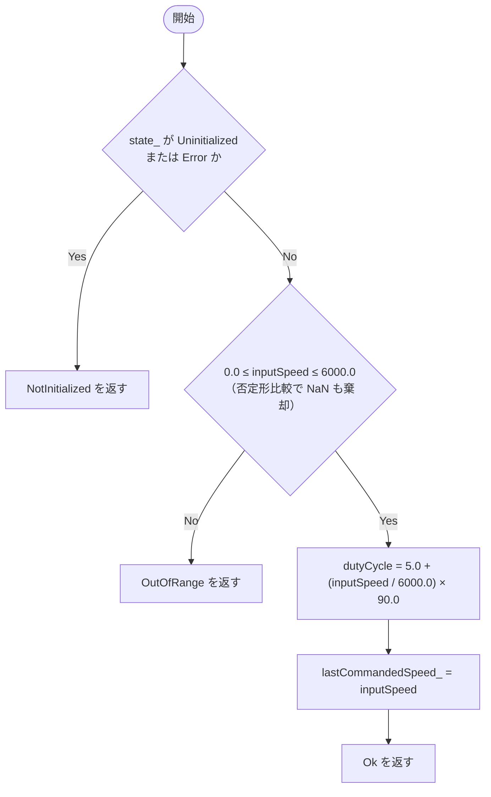
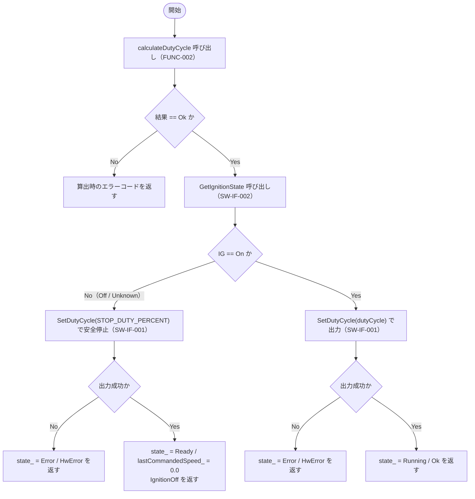
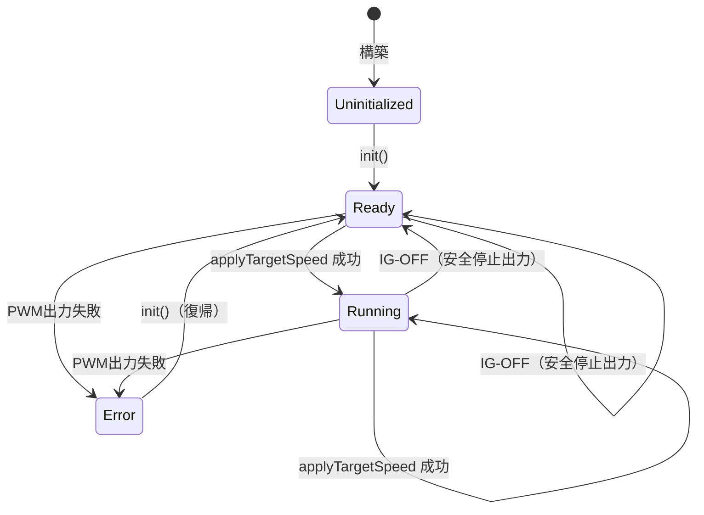

# SW詳細設計書（SW Detailed Design）— MOD-001 MotorController

> **成果物ID:** 04-05 SW Detailed Design
> **参照プロセス:** SWE.3 SW Detailed Design and Unit Construction
> **注:** 本書は Work Instructions のプロセスを実演するためのサンプル成果物である。PF Vehicle API の詳細設計は [04-05-PT01-PFVAPI](./04-05-pf-vehicle-api-detailed-design.md) を参照。

---

## 文書管理情報

| 項目 | 内容 |
|------|------|
| 文書番号 | 04-05-PT01-MOD001 |
| バージョン | v1.1 |
| ステータス | Approved |
| プロジェクト名 | ProcessTest（SWEプロセスサンプル） |
| 対象モジュール | MOD-001 MotorController（APPレイヤー） |
| 作成者 | Dev |
| 作成日 | 2026-09-28 |
| 承認者 | Lead Developer |
| 承認日 | 2026-09-28 |
| 関連GitHub Issue | #5（[SWE.3] MotorController 詳細設計・実装） |
| 関連Pull Request | #6（feature/5-implement-motor-control-unit） |
| 前工程成果物リンク | [04-04 SWアーキテクチャ設計書](./04-04-sw-architectural-design.md) |
| 次工程成果物リンク | 11-05: `app/motor_control/` / [08-50 ユニットテスト仕様書](../test/swe4/08-50-unit-test-specification.md) |

### 改訂履歴

| バージョン | 日付 | 変更内容 | 変更者 | 承認者 |
|-----------|------|---------|-------|-------|
| v1.0 | 2026-09-28 | 初版作成 | Dev | Lead Developer |
| v1.1 | 2026-09-28 | 3 層構成への再編（配置パス変更・車載 API 名前空間 pf::vapi へ変更）。ロジック変更なし | Dev | Lead Developer |

---

## 1. モジュール概要

| 項目 | 内容 |
|------|------|
| モジュールID | MOD-001 |
| モジュール名 | MotorController |
| ファイル名 | `app/motor_control/src/motor_controller.cpp` / `app/motor_control/include/app/motor_control/motor_controller.hpp` |
| 責務 | 目標回転数の入力検証・PWM デューティ比への線形変換・IG 判定・車載 API 経由の出力・状態管理 |
| ASILレベル | ASIL-B |
| 割り当てSW要求 | SW-REQ-001〜005, SW-REQ-PWR-001 |
| 関連アーキテクチャ要素 | 04-04 COMP-001 / MOD-001 |
| 関連I/F仕様ID | SW-IF-001（pf::vapi::IPwmService）/ SW-IF-002（pf::vapi::IIgnitionService） |

---

## 2. データ設計

### 2.1 データ型定義

| 型名 | 基底型 | 値範囲 | 単位 | デフォルト値 | Description | ASIL | ステータス |
|------|------|--------|------|--------------|-------------|------|----------|
| `app::ControlStatus` | `std::uint8_t`（enum class） | Ok(0) / NotInitialized(1) / OutOfRange(2) / HwError(3) / IgnitionOff(4) | — | — | 制御 API の戻り値（エラーコード） | ASIL-B | closed |
| `app::MotorState` | `std::uint8_t`（enum class） | Uninitialized(0) / Ready(1) / Running(2) / Error(3) | — | Uninitialized | 内部状態（§4 状態機械） | ASIL-B | closed |
| `pf::vapi::IgnitionState` | `std::uint8_t`（enum class） | Off(0) / On(1) / Unknown(2) | — | — | IG 状態（車載 API 定義。契約面） | ASIL-B | closed |

### 2.2 モジュール変数（メンバ変数）

| 変数名 | 型 | スコープ | 初期値 | 値範囲 | 単位 | Description | ASIL | ステータス |
|-------|------|--------|-------|--------|------|-------------|------|----------|
| `pwmService_` | `pf::vapi::IPwmService&` | member | コンストラクタ注入 | — | — | 車載 API: PWM 出力サービス（非所有参照） | ASIL-B | closed |
| `ignitionService_` | `pf::vapi::IIgnitionService&` | member | コンストラクタ注入 | — | — | 車載 API: IG 状態サービス（非所有参照） | ASIL-B | closed |
| `state_` | `MotorState` | member | Uninitialized | enum 定義値 | — | 現在の状態 | ASIL-B | closed |
| `lastCommandedSpeed_` | `float` | member | 0.0f | 0.0〜6000.0 | rpm | 最後に正常受理した目標回転数 | ASIL-B | closed |

### 2.3 定数定義（マジックナンバー排除）

| 定数ID | 名称 | 値 | 型 | 用途 | 関連要求ID |
|--------|------|----|----|------|------------|
| CONST-001 | `MOTOR_MAX_SPEED_RPM` | 6000.0f | float | 目標回転数の上限 [rpm] | SW-REQ-001 |
| CONST-002 | `DUTY_MIN` | 5.0f | float | デューティ比下限 [%] | SW-REQ-001 |
| CONST-003 | `DUTY_MAX` | 95.0f | float | デューティ比上限 [%] | SW-REQ-001 |
| CONST-004 | `STOP_DUTY_PERCENT` | 0.0f | float | 安全停止時の出力デューティ比 [%] | SW-REQ-PWR-001 |

---

## 3. 関数設計

### 3.1 関数一覧

| 関数ID | 関数名 | シグネチャ | 責務概要 | 割り当てSW要求 | 関連I/F仕様ID | ASIL | ステータス |
|-------|-------|---------|---------|-------------|--------------|------|----------|
| FUNC-001 | `init` | `ControlStatus init() noexcept` | 初期化・Ready 遷移・Error 復帰 | SW-REQ-003, 004, 005 | N/A | ASIL-B | closed |
| FUNC-002 | `calculateDutyCycle` | `ControlStatus calculateDutyCycle(float inputSpeed, float& dutyCycle) noexcept` | 入力検証と線形変換（出力なし） | SW-REQ-001, 002, 003 | N/A | ASIL-B | closed |
| FUNC-003 | `applyTargetSpeed` | `ControlStatus applyTargetSpeed(float inputSpeed) noexcept` | IG 判定・車載 API 経由の PWM 出力・状態遷移 | SW-REQ-001〜005, PWR-001 | SW-IF-001, SW-IF-002 | ASIL-B | closed |
| FUNC-004 | `getState` | `MotorState getState() const noexcept` | 状態の参照 | SW-REQ-004 | N/A | QM | closed |
| FUNC-005 | `getLastCommandedSpeed` | `float getLastCommandedSpeed() const noexcept` | 受理値の参照 | SW-REQ-002 | N/A | QM | closed |

### 3.2 関数詳細

#### FUNC-002：`calculateDutyCycle`

| 項目 | 内容 |
|------|------|
| シグネチャ | `ControlStatus calculateDutyCycle(float inputSpeed, float& dutyCycle) noexcept` |
| 責務 | 未初期化チェック・値域チェックを行い、目標回転数をデューティ比へ線形変換する。HW 出力は行わない |
| 割り当てSW要求 | SW-REQ-001, SW-REQ-002, SW-REQ-003 |
| 実装ファイル | `app/motor_control/src/motor_controller.cpp` |
| Doxygen記載方針 | @brief / @param（Range 付き）/ @return / @details / @pre / @post / @see を記載 |

**引数**

| 引数名 | 型 | 方向 | 値範囲 | 単位 | Description |
|-------|------|------|--------|------|-------------|
| `inputSpeed` | float | IN | 0.0〜6000.0 | rpm | 目標回転数 |
| `dutyCycle` | float& | OUT | 5.0〜95.0（正常時） | % | 算出されたデューティ比 |

**戻り値**

| 値 | 意味 | 発生条件 | 呼び出し元の対応 |
|----|------|----------|------------------|
| `Ok` | 正常終了 | 前提条件充足 | 通常処理を継続 |
| `NotInitialized` | 未初期化 | state_ が Uninitialized / Error | init() を実行して再試行 |
| `OutOfRange` | 範囲外入力 | inputSpeed < 0 または > 6000 または NaN | 入力値を修正して再試行 |

**処理フロー**

**事前条件 / 事後条件 / 不変条件**

| 種別 | 条件 |
|------|------|
| 事前条件 | init() 完了済み（state_ が Ready / Running）。0.0f ≤ inputSpeed ≤ MOTOR_MAX_SPEED_RPM |
| 事後条件 | 正常時: dutyCycle ∈ [DUTY_MIN, DUTY_MAX] かつ lastCommandedSpeed_ == inputSpeed。エラー時: dutyCycle・内部状態は不変。ヒープ使用量不変 |
| 不変条件 | lastCommandedSpeed_ ∈ [0.0f, MOTOR_MAX_SPEED_RPM]。state_ は MotorState 定義値 |

#### FUNC-003：`applyTargetSpeed`

| 項目 | 内容 |
|------|------|
| シグネチャ | `ControlStatus applyTargetSpeed(float inputSpeed) noexcept` |
| 責務 | FUNC-002 で算出したデューティ比を、IG 状態確認のうえ車載 API（SW-IF-001）で出力し、状態遷移を行う |
| 割り当てSW要求 | SW-REQ-001〜005, SW-REQ-PWR-001 |

**処理フロー**

**決定表（IG 状態 × 出力結果）**

| IG 状態 | PWM 出力結果 | 実施処理 | 戻り値 | 遷移先状態 |
|---------|-------------|---------|--------|-----------|
| On | 成功 | 算出デューティ比を出力 | Ok | Running |
| On | 失敗 | — | HwError | Error |
| Off / Unknown | 成功 | 停止デューティ比（0.0 %）を出力 | IgnitionOff | Ready |
| Off / Unknown | 失敗 | — | HwError | Error |

**事前条件 / 事後条件**

| 種別 | 条件 |
|------|------|
| 事前条件 | FUNC-002 と同一 |
| 事後条件 | Ok 時: state_ == Running。IgnitionOff 時: state_ == Ready かつ lastCommandedSpeed_ == 0.0f（安全停止済み）。HwError 時: state_ == Error |

#### FUNC-001 / FUNC-004 / FUNC-005（参照系・初期化）

| 関数ID | 事前条件 | 事後条件 |
|--------|---------|---------|
| FUNC-001 `init` | なし（任意の状態から呼び出し可能） | state_ == Ready かつ lastCommandedSpeed_ == 0.0f |
| FUNC-004 `getState` | なし | 副作用なし（const） |
| FUNC-005 `getLastCommandedSpeed` | なし | 副作用なし（const）。戻り値 ∈ [0.0f, 6000.0f] |

### 3.3 エラー処理・例外処理設計

| エラーID | 対象関数ID | エラー種別 | 発生条件 | 検出方法 | 対処方法 | 呼び出し元通知方法 | 復旧方法 | ログ要否 |
|----------|------------|------------|----------|----------|----------|--------------------|----------|----------|
| ERR-001 | FUNC-002/003 | 異常入力 | inputSpeed が範囲外・NaN | 否定形の値域比較 | 処理を中断し内部状態を保持 | 戻り値 OutOfRange | 呼び出し側が入力を修正 | 不要（サンプル簡略化） |
| ERR-002 | FUNC-002/003 | 呼び出し順序違反 | 未初期化（Uninitialized / Error）での要求 | state_ 判定 | 処理を中断 | 戻り値 NotInitialized | init() 実行 | 不要（同上） |
| ERR-003 | FUNC-003 | HW異常 | SW-IF-001 SetDutyCycle が false | 戻り値判定 | Error 状態へ遷移し以降の要求を拒否 | 戻り値 HwError | init() による再初期化 | 要（実機では ERROR レベル） |
| ERR-004 | FUNC-003 | 車両状態（IG-OFF）| IG が On 以外（Unknown 含む） | SW-IF-002 戻り値判定 | 停止デューティ比を出力し安全停止 | 戻り値 IgnitionOff | IG-ON 復帰後に再要求 | 要（実機では INFO レベル） |

| 例外ID | 対象関数ID | 例外種別 | 送出有無 | noexcept方針 | 備考 |
|--------|------------|----------|----------|--------------|------|
| EXC-001 | 全関数 | — | 非送出 | 全 public 関数に noexcept 指定 | A15-0-1 準拠。異常はすべてエラーコードで通知（前提条件違反時の対処方針: ASIL-B のためエラーコード返却で呼び出し側に回復を委ねる） |

---

## 4. 状態機械設計

| 状態 | 説明 | Entry処理 | 遷移条件 | 遷移先状態 | 異常遷移 |
|------|------|-----------|----------|------------|----------|
| Uninitialized | 構築直後。制御要求を拒否 | — | init() | Ready | — |
| Ready | 初期化済み・出力停止中 | lastCommandedSpeed_=0.0 | applyTargetSpeed 成功 | Running | PWM失敗 → Error |
| Running | PWM 出力中 | — | IG-OFF 検出（安全停止） | Ready | PWM失敗 → Error |
| Error | HW 異常検出。制御要求を拒否 | — | init() | Ready | — |

---

## 5. アーキテクチャ設計 ↔ 詳細設計 ↔ ソースコード トレーサビリティ

| SW要求ID | アーキテクチャ割り当て | I/F仕様ID | 詳細設計（FUNC-ID / 章番号） | ソースコードファイル | 関数/クラス | ステータス |
|---------|--------------------|-----------|----------------------------|--------------------|------------|----------|
| SW-REQ-001 | MOD-001 | N/A | FUNC-002 / §3.2 | `app/motor_control/src/motor_controller.cpp` | `calculateDutyCycle()` | traced |
| SW-REQ-002 | MOD-001 | N/A | FUNC-002 / §3.2, ERR-001 | 同上 | `calculateDutyCycle()` | traced |
| SW-REQ-003 | MOD-001 | N/A | FUNC-001, 002 / §3.2, ERR-002 | 同上 | `init()` / `calculateDutyCycle()` | traced |
| SW-REQ-004 | MOD-001 | N/A | §4 状態機械 | 同上 | `MotorState` / 各関数 | traced |
| SW-REQ-005 | MOD-001 | SW-IF-001 | FUNC-003 / §3.2, ERR-003 | 同上 | `applyTargetSpeed()` | traced |
| SW-REQ-PWR-001 | MOD-001 | SW-IF-001, 002 | FUNC-003 / §3.2, ERR-004 | 同上 | `applyTargetSpeed()` | traced |

> SW-REQ-200/201（車載 API）のトレースは [04-05-PT01-PFVAPI §4](./04-05-pf-vehicle-api-detailed-design.md) を参照。

---

## 6. タイミング制約設計

本サンプルは周期タスク・ISR を持たないため非該当（N/A）。実機適用時は制御周期・IG-OFF 後の停止完了デッドラインを定義すること。

## 7. ログ設計

本サンプルはログ基盤を持たないため簡略化する。実機適用時は ERR-003（ERROR）・ERR-004（INFO）のログ出力を定義すること（§3.3 ログ要否列参照）。

---

## 8. テスト容易性設計

| 対象関数/クラス | 依存先 | 依存注入方法 | モック対象 | 単体テスト方法 | 状態遷移検証方法 |
|----------------|--------|--------------|------------|----------------|------------------|
| MotorController | pf::vapi::IPwmService / IIgnitionService（車載 API 契約面） | コンストラクタ引数（参照注入） | 両 I/F とも要。`test/unit/mocks/vapi_mock/`（PF チーム管理）に共通モックを配置 | GoogleTest。モックで HW 失敗・IG 状態を自在に模擬。**Firmware 不要で完結** | getState() による観測 + モック呼び出し記録 |

---

## 9. アルゴリズム評価

| 評価ID | 対象 | 評価観点 | 評価条件 | 期待結果 | 判定 |
|--------|------|----------|----------|----------|------|
| ALG-001 | FUNC-002 線形変換 | 正常値・境界値・数値精度 | 0/1500/3000/4500/6000 rpm | 誤差 ±0.01 % 以内（float 単精度で十分） | OK |
| ALG-002 | FUNC-002 | 異常値 | 負値・上限超過・NaN | すべて OutOfRange で棄却 | OK |

## 10. FMEA反映設計

| FMEA ID | 対象 | 故障モード | 検出方法 | 対策 | 復旧方法 | 関連要求ID |
|---------|------|------------|----------|------|----------|------------|
| FMEA-001 | SW-IF-001 | PWM 出力失敗 | API 戻り値 | Error 状態へ遷移・要求拒否 | init() 再初期化 | SW-REQ-005 |
| FMEA-002 | SW-IF-002 | IG 信号取得失敗（Unknown） | API 戻り値 | IG-OFF と同等に扱い安全停止（フェールセーフ） | IG 信号復旧後に再要求 | SW-REQ-PWR-001 |

## 11. キャリブレーション設計 / 12. 他コンポーネント異常耐性設計

本サンプルでは非該当（N/A）。IG 信号取得失敗時の挙動は §10 FMEA-002 でカバーする。

---

## 13. 後工程適合性確認

| 確認項目 | 確認内容 | 確認先工程 | 確認結果 | 確認者 |
|----------|----------|------------|----------|--------|
| ユニットテスト可能性 | 車載 API 2 種をコンストラクタ注入で vapi_mock に差し替え可能 | SWE.4 | OK | TVE |
| カバレッジ達成可能性 | 全分岐がモック操作で到達可能（ASIL-B: C0/C1 100%） | SWE.4 | OK | TVE |
| 静的解析適用可能性 | AUTOSAR C++14 ルールセットで解析可能な構造 | SWE.4 | OK | Dev |
| 統合I/F整合性 | ユニット I/F が 04-04 SW-IF-001/002 と一致 | SWE.5 | OK | Arch |
| ビルド成功確認 | CI（build.yml）でビルド・レイヤー依存チェックが成功 | SWE.5 | OK | Dev |

**サイクロマティック複雑度評価（SWE.3 Step 4.4）:** 最大は FUNC-003 `applyTargetSpeed` の 5。全関数 10 以下で逸脱なし。

---

## 14. AI/LLM使用記録

| 記録項目 | 内容 |
|---------|------|
| 使用ツール | Claude Code |
| 活用範囲 | 本書ドラフト生成・ソースコード（11-05）生成・ユニットテストコード生成 |
| 活用目的 | SWE.3 詳細設計・実装の効率化 |
| 最終確認者 | Dev / Lead Developer（コミット前レビューによる人手確認） |
| 最終確認日 | 2026-09-28 |

## 15. OSS利用一覧

| OSS名 | Version | 用途 | 利用コンポーネント | ライセンス | OSS確認状況 |
|--------|--------|--------|--------|--------|--------|
| GoogleTest | 1.14.0 | ユニット・統合・適格性テストフレームワーク（テスト専用。製品コードにリンクしない） | test/ 配下全テスト | BSD-3-Clause | 確認済み（SWE.2 で採用決定済みとする） |

---

## 付録A：車載特有要求確認表

| 確認カテゴリ | 確認項目 | 対応関数/設計ID | 確認結果 |
|--------------|----------|----------------|----------|
| IG-ON | 起動時の初期化（init による Ready 遷移） | FUNC-001 | 該当 |
| IG-OFF | 出力の安全停止・Ready 遷移 | FUNC-003 / ERR-004 | 該当 |
| 診断 | UDS / DTC 管理 | — | 非該当（本サンプル対象外） |
| スリープ / ウェイクアップ | — | — | 非該当（本サンプル対象外） |
| E2E | — | — | 非該当（外部通信なし） |
