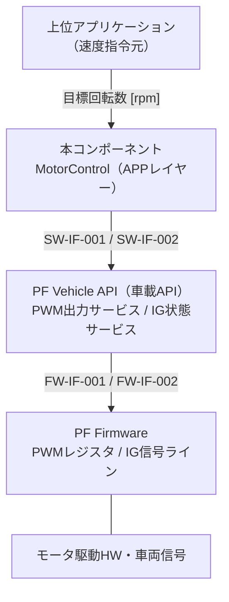

# SW要求仕様書（Software Requirements Specification）

> **成果物ID:** 17-11 Software Requirements Specification（別名表記: 17-00-A）
> **参照プロセス:** SWE.1 Software Requirements Analysis
> **注:** 本書は Work Instructions のプロセスを実演するためのサンプル成果物である。上位のシステム要求（SYS-REQ-NNN）は仮置きである。

---

## 文書管理情報

| 項目 | 内容 |
|------|------|
| 文書番号 | 17-11-PT01-MOTORCTRL |
| バージョン | v1.1 |
| ステータス | Approved |
| プロジェクト名 | ProcessTest（SWEプロセスサンプル） |
| 対象コンポーネント | モータ制御コンポーネント（MotorControl）＋ PF Vehicle API |
| 作成者 | PO / Dev |
| 作成日 | 2026-09-28 |
| レビュー担当 | Arch / TVE |
| 承認者 | PO |
| 承認日 | 2026-09-28 |
| 関連GitHub Issue | #1（[SWE.1] MotorControl SW要求定義） |
| 関連Pull Request | #2 |

### 改訂履歴

| バージョン | 日付 | 変更内容 | 変更者 | 承認者 |
|-----------|------|---------|-------|-------|
| v1.0 | 2026-09-28 | 初版作成 | Dev | PO |
| v1.1 | 2026-09-28 | PF/APP/ECU 3 層構成への再編に伴い I/F 要求・コンテキスト図を更新 | Dev | PO |

---

## 1. 適用範囲（Scope）

### 1.1 対象

本文書はモータ制御 ECU のソフトウェアコンポーネント **MotorControl（APP レイヤー）** に対する SW 要求を定義する。
本コンポーネントは PF レイヤー（Vehicle API）が提供する**車載 API**（PWM 出力サービス・IG 状態サービス）を使用する前提とする。車載 API の実装（Vehicle API 層）に対する I/F 要求も §3.3 に含む。

上位文書として以下を参照する。

- システム要求仕様書（17-12）：17-12-PT01（仮置き）
- I/F要求仕様書（17-08 / 17-00-B）：契約面 `pf/vehicle_api/include/pf/vapi/` + 04-04 §4

### 1.2 除外事項

- PF Firmware 層（HW ドライバ実装）自体の要求は対象外（PF 側成果物で管理）
- モータの回転数フィードバック制御（PID 等）は本サンプルの対象外
- 診断（UDS/DTC）・スリープ/ウェイクアップ要求は本サンプルでは対象外（付録D参照）

---

## 2. システム概要

### 2.1 システム説明

目標回転数 [rpm] の指令を受け、PWM デューティ比 [%] に線形変換して PF レイヤーの車載 API 経由でモータへ出力する。IG-OFF 時は出力を安全停止する。

### 2.2 動作環境・制約

| 項目 | 内容 |
|------|------|
| ハードウェアプラットフォーム | 車載 ECU（ホスト検証は Linux SIL 環境。`ecu/` 統合ルート参照） |
| OS / RTOS | POSIX 互換（サンプルのため抽象化） |
| プログラミング言語 | C++14 |
| コーディング規約 | AUTOSAR C++14 Guidelines |
| 開発ツールチェーン | CMake（Presets 固定）/ GCC / GoogleTest / gcov・gcovr（docker/ の共通イメージ） |
| 主要インターフェース | 車載API: PWM出力サービス（SW-IF-001）・IG状態サービス（SW-IF-002） |

### 2.3 コンテキスト図

---

## 3. SW要求一覧

### 3.1 機能要求（Functional Requirements）

| 要求ID | 要求名称 | 要求内容 | Description | 作成者 | 優先度 | ASIL | セキュリティ属性（TARA-ID） | 依存要求ID | テスト観点 | リグレッション影響範囲 | トレース元（システム要求ID） | ステータス | 備考 |
|--------|---------|---------|------------|-------|--------|------|--------------------------|------------|------------|----------------------|--------------------------|----------|------|
| SW-REQ-001 | デューティ比線形変換 | システムは目標回転数 0〜6000 rpm を PWM デューティ比 5.0〜95.0 % に線形変換すること | 変換式: duty = 5.0 + (speed / 6000) × 90.0 | Dev | Must | ASIL-B | - | - | 正常系・境界値 | 変換処理全体 | SYS-REQ-010 | verified | |
| SW-REQ-002 | 範囲外入力の棄却 | システムは範囲外（負値・6000 rpm 超・非数値）の目標回転数を受理せず、エラーコード OutOfRange を返し、直前の出力と内部状態を保持すること | NaN 入力を含む（防御的プログラミング） | Dev | Must | ASIL-B | - | SW-REQ-001 | 異常系・境界値 | 入力検証・出力保持 | SYS-REQ-012 | verified | |
| SW-REQ-003 | 未初期化時の動作拒否 | システムは初期化完了前の制御要求を受理せず、エラーコード NotInitialized を返し、HW への出力を行わないこと | Error 状態も未初期化と同等に扱う | Dev | Must | ASIL-B | - | SW-REQ-004 | 異常系 | 初期化シーケンス | SYS-REQ-012 | verified | |
| SW-REQ-004 | 状態管理 | システムは Uninitialized / Ready / Running / Error の4状態を管理し、定義された遷移（04-05 §4）のみを許可すること | 状態遷移図は 04-05 参照 | Dev | Must | QM | - | - | 正常系 | 状態機械全体 | SYS-REQ-010 | verified | |
| SW-REQ-005 | HW異常時のフェール動作 | システムは PWM 出力失敗を検出した場合、エラーコード HwError を返して Error 状態へ遷移し、再初期化まで制御要求を受理しないこと | Error 状態からの復帰は init() のみ | Dev | Must | ASIL-B | - | SW-REQ-004 | 異常系 | エラー処理・復旧経路 | SYS-REQ-012 | verified | |

### 3.2 電源状態要求（IG-ON / IG-OFF Requirements）

| 要求ID | 電源状態 / トリガー | 要求内容 | 完了条件 | 時間制約 | 依存要求ID | テスト観点 | リグレッション影響範囲 | トレース元 | ステータス | 備考 |
|--------|------------------|---------|---------|---------|------------|------------|----------------------|----------|----------|------|
| SW-REQ-PWR-001 | IG-OFF | システムは制御要求時に IG 状態を車載 API で確認し、IG-OFF または IG 状態取得失敗の場合はデューティ比 0.0 % を出力して安全停止し、エラーコード IgnitionOff を返して Ready 状態へ遷移すること | 停止出力完了・Ready 遷移 | 次回制御要求内（本サンプルでは周期制約なし） | SW-REQ-001 | 正常系・異常系 | IG 判定・安全停止処理 | SYS-REQ-011 | verified | 取得失敗（Unknown）は IG-OFF と同等に扱う（フェールセーフ） |

### 3.3 インターフェース要求（Interface Requirements）

| 要求ID | インターフェース名 | 種別 | 方向 | 要求内容 | ASIL | セキュリティ属性（TARA-ID） | トレース元（17-08 ID） | ステータス | 備考 |
|--------|----------------|------|------|---------|------|--------------------------|---------------------|----------|------|
| SW-REQ-200 | PWM出力サービス | API（車載API） | 出力 | APP は PWM 出力を車載 API `pf::vapi::IPwmService::SetDutyCycle()` 経由でのみ行うこと（Firmware・HW への直接アクセス禁止）。Vehicle API 実装は API 境界で入力値域（0.0〜100.0 %）を検証すること | ASIL-B | - | IF-REQ-001（仮置き） | verified | 契約面: `pf/vapi/i_pwm_service.hpp` |
| SW-REQ-201 | IG状態サービス | API（車載API） | 入力 | APP は IG 状態を車載 API `pf::vapi::IIgnitionService::GetIgnitionState()` 経由で取得すること。Vehicle API 実装は IG 信号ラインの電気的状態（High/Low/Fault）を車両状態（On/Off/Unknown）へ解釈すること | ASIL-B | - | IF-REQ-002（仮置き） | verified | 契約面: `pf/vapi/i_ignition_service.hpp` |

---

## 4. 制約条件

| 制約ID | 種別 | 内容 | 根拠 |
|--------|------|------|------|
| SW-CON-001 | 規格制約 | AUTOSAR C++14 Guidelines に準拠すること（例外不使用・動的メモリ確保禁止を含む） | 社内コーディング規約 |
| SW-CON-002 | 設計制約 | レイヤー間 I/F は依存性注入により差し替え可能であること（テスト可能設計） | SWE.3 設計指針 |
| SW-CON-003 | 品質制約 | 各関数のサイクロマティック複雑度は 10 以下であること | SWE.3 Step 4.4 |
| SW-CON-004 | アーキテクチャ制約 | APP 層は PF Vehicle API（契約面）のみに依存し、Firmware 層への直接依存を禁止する（CI で機械的に検証） | 04-04 §1.2 / scripts/check_layer_deps.sh |

---

## 5. 検証基準（17-50参照）

全 SW 要求に対する検証基準は [17-50 Verification Criteria](./17-50-verification-criteria.md) に定義する（VC-001〜VC-006）。

---

## 6. トレーサビリティマトリクス（抜粋）

完全版は [13-22 Traceability Record](../traceability/13-22-traceability-record.md) を参照。

### 6.1 システム要求 → SW要求（下向きトレース）

| システム要求ID | システム要求名 | 対応するSW要求ID |
|--------------|-------------|----------------|
| SYS-REQ-010（仮置き） | モータ回転数制御 | SW-REQ-001, SW-REQ-004 |
| SYS-REQ-011（仮置き） | IG-OFF時の出力停止 | SW-REQ-PWR-001 |
| SYS-REQ-012（仮置き） | 故障時フェールセーフ | SW-REQ-002, SW-REQ-003, SW-REQ-005 |

### 6.2 SW要求 → 検証基準

| SW要求ID | 対応する検証基準ID |
|---------|----------------|
| SW-REQ-001 | VC-001 |
| SW-REQ-002 | VC-002 |
| SW-REQ-003 | VC-003 |
| SW-REQ-004 | VC-004 |
| SW-REQ-005 | VC-005 |
| SW-REQ-PWR-001 | VC-006 |
| SW-REQ-200 / SW-REQ-201 | VC-001〜006 で統合検証 + SWE4-TC-101〜106（Vehicle API 単体） |

---

## 7. 機能安全要求（ISO 26262）

### 7.1 安全ゴールとASIL分類

| 安全ゴールID | 安全ゴール | ASILレベル | 関連するSW要求ID |
|------------|---------|-----------|----------------|
| SG-001（仮置き） | 意図しないモータ出力を防止する | ASIL-B | SW-REQ-001, SW-REQ-002, SW-REQ-003, SW-REQ-005, SW-REQ-PWR-001 |

> ASIL 分類は FSS が実施済みとする（サンプル）。ASIL 分類の AI への委任は禁止（AI/LLM 活用ガイドライン参照）。

---

## 8. サイバーセキュリティ要求（ISO/SAE 21434）

本コンポーネントは外部通信 I/F を持たず、本サンプルではセキュリティ要求対象外とする（CSS 確認済みとする）。

---

## 9. AI/LLM使用記録

| 記録項目 | 内容 |
|---------|------|
| 使用ツール | Claude Code |
| 活用範囲 | 本文書のドラフト生成・要求文の曖昧表現チェック |
| 活用目的 | SWE.1 要求ドラフト作成の効率化 |
| 最終確認者 | PO / Dev（人手による最終確定） |
| 最終確認日 | 2026-09-28 |
