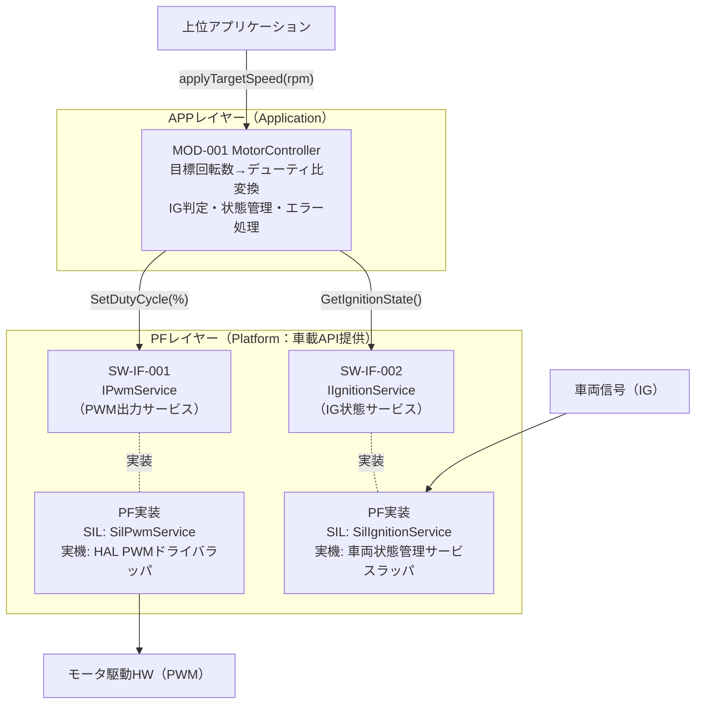
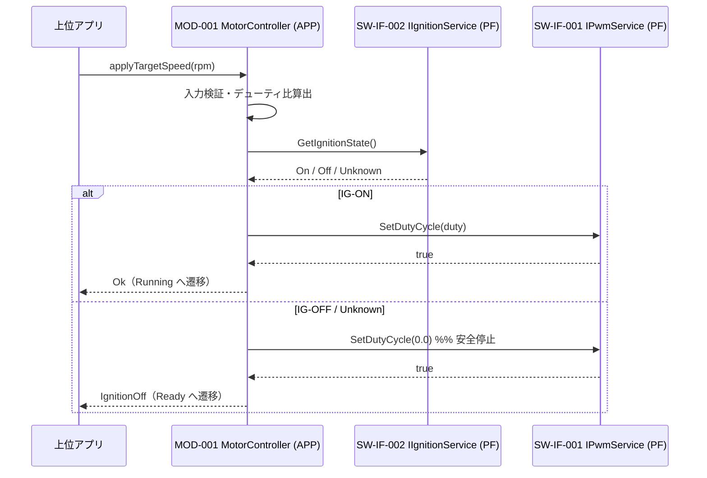

# SWアーキテクチャ設計書（SW Architectural Design）

> **成果物ID:** 04-04 SW Architectural Design
> **参照プロセス:** SWE.2 Software Architectural Design
> **注:** 本書は Work Instructions のプロセスを実演するためのサンプル成果物である。

---

## 文書管理情報

| 項目 | 内容 |
|------|------|
| 文書番号 | 04-04-PT01-MOTORCTRL |
| バージョン | v1.0 |
| ステータス | Approved |
| プロジェクト名 | ProcessTest（SWEプロセスサンプル） |
| 対象コンポーネント | モータ制御コンポーネント（MotorControl） |
| 作成者 | Arch |
| 作成日 | 2026-09-28 |
| 承認者 | Arch（Lead） |
| 承認日 | 2026-09-28 |
| 関連GitHub Issue | #3（[SWE.2] MotorControl アーキテクチャ設計） |
| 前工程成果物リンク | [17-11 SW要求仕様書](../swe1/17-11-sw-requirements-specification.md) / [17-50 検証基準](../swe1/17-50-verification-criteria.md) |
| 次工程成果物リンク | [04-05 SW詳細設計書](../swe3/04-05-sw-detailed-design.md) |

### 改訂履歴

| バージョン | 日付 | 変更内容 | 変更者 | 承認者 |
|-----------|------|---------|-------|-------|
| v1.0 | 2026-09-28 | 初版作成（PF/APP 2レイヤー構成） | Arch | Arch（Lead） |

---

## 1. アーキテクチャ概要

### 1.1 設計方針

本ソフトウェアは **PF（プラットフォーム）レイヤー** と **APP（アプリケーション）レイヤー** の 2 層で構成する。

| 方針 | 内容 |
|------|------|
| レイヤー分離 | HW・車両信号依存部を PF レイヤーに閉じ込め、APP レイヤーは PF が提供する**車載 API（抽象インターフェース）** のみに依存する |
| 依存性注入 | APP は車載 API をコンストラクタ注入で受け取る。ユニットテストではモック、SIL 検証では PF SIL 実装、実機では HAL 実装に差し替える（テスト可能設計） |
| 車載 API の抽象化 | 実機では AUTOSAR Adaptive Platform / ベンダ SDK の API を PF 実装がラップする。APP からは環境差異が見えない |
| フェールセーフ | IG 状態取得失敗（Unknown）は IG-OFF と同等に扱い、安全側（出力停止）に倒す |

### 1.2 アーキテクチャ制約

| 制約 | 内容 | 根拠 | 関連要求ID |
|------|------|------|------------|
| コーディング規約 | AUTOSAR C++14 Guidelines 準拠（例外不使用・動的メモリ確保禁止） | 社内規約 | SW-CON-001 |
| レイヤー間依存方向 | APP → PF（車載 API）の一方向のみ。PF は APP に依存しない | レイヤードアーキテクチャ原則 | SW-REQ-200, SW-REQ-201 |
| HW 直接アクセス禁止 | APP レイヤーから HW レジスタ・デバイスファイルへの直接アクセスを禁止する | 移植性・テスト可能性 | SW-REQ-200 |
| 機能安全要求 | ASIL-B: 入力検証・フェールセーフ動作を APP 内に実装 | ISO 26262 / SG-001 | SW-REQ-002, 003, 005, PWR-001 |

---

## 2. SWコンポーネント構成図

### 2.1 コンポーネント一覧

| コンポーネントID | コンポーネント名 | 責務 | レイヤー | 配置先 | ASIL | セキュリティ対象 | 主なI/F |
|------------------|------------------|------|----------|--------|------|------------------|----------|
| COMP-001 | MotorControl | 目標回転数の PWM 変換・IG 判定・状態管理 | Application | Linux（SIL）/ 車載ECU | ASIL-B | 非対象 | SW-IF-001, SW-IF-002 |
| COMP-002 | PF Services | 車載 API（PWM 出力・IG 状態）の提供 | Platform / Middleware | 同上 | ASIL-B（I/F 経路） | 非対象 | SW-IF-001, SW-IF-002 |

---

## 3. SWモジュール定義

| モジュールID | モジュール名 | 責務 | ASIL | レイヤー | 割り当てSW要求 | ステータス |
|-----------|-----------|------|------|----------|--------------|----------|
| MOD-001 | MotorController | 線形変換・入力検証・IG判定・状態管理・エラー処理 | ASIL-B | APP | SW-REQ-001〜005, SW-REQ-PWR-001 | closed |
| MOD-101 | SilPwmService | SW-IF-001 の SIL 実装（値域検証・履歴記録・故障注入） | QM（検証用） | PF | SW-REQ-200（検証系） | closed |
| MOD-102 | SilIgnitionService | SW-IF-002 の SIL 実装（IG状態模擬） | QM（検証用） | PF | SW-REQ-201（検証系） | closed |

#### MOD-001：MotorController

| 項目 | 内容 |
|------|------|
| ファイル名 | `src/app/motor_control/motor_controller.cpp` / `.hpp` |
| 責務 | 目標回転数の受理判定・デューティ比算出・IG 判定・車載 API 経由の出力・状態管理 |
| 割り当てSW要求 | SW-REQ-001〜005, SW-REQ-PWR-001, SW-REQ-200, SW-REQ-201 |
| ASILレベル | ASIL-B |
| 依存モジュール | なし（PF 車載 API のインターフェースのみに依存） |
| 関連I/F | SW-IF-001, SW-IF-002 |

---

## 4. インターフェース設計（車載 API）

### 4.1 レイヤー間インターフェース

| I/F ID | I/F名称 | 方向 | 種別 | シグネチャ | 提供レイヤー | 参照17-08 / SW-REQ | ASIL | ステータス |
|--------|----------|------|------|-----------|-------------|--------------------|------|----------|
| SW-IF-001 | PWM出力サービス | APP → PF | API（車載API） | `bool pf::IPwmService::SetDutyCycle(float dutyCyclePercent)`（Range: 0.0〜100.0 %） | PF | IF-REQ-001 / SW-REQ-200 | ASIL-B | closed |
| SW-IF-002 | IG状態サービス | PF → APP（取得） | API（車載API） | `pf::IgnitionState pf::IIgnitionService::GetIgnitionState()`（Off / On / Unknown） | PF | IF-REQ-002 / SW-REQ-201 | ASIL-B | closed |

> **命名規則:** PF 公開 I/F（車載 API）のメソッドは PascalCase、APP 内部 API は camelCase とし、レイヤーを区別する。

### 4.2 主要シーケンス（制御要求）

---

## 5. テスト観点事前計画

| モジュールID | 関連SW要求ID | テスト観点 | モック要否 | スタブ要否 | 異常系確認方法 | SWE.4/SWE.5での確認観点 |
|--------------|--------------|------------|------------|------------|----------------|--------------------------|
| MOD-001 | SW-REQ-001〜005, PWR-001 | 正常系・異常系・境界値 | 要（車載 API 2種をモック化） | 不要 | モックによる HW 失敗・IG-OFF 模擬 | SWE.4: 単体ロジック / SWE.5: PF SIL 実装との統合 I/F 整合 |
| MOD-101/102 | SW-REQ-200, 201 | 統合時に検証 | 不要 | — | 故障注入 API | SWE.5: レイヤー間 I/F 整合性 |

---

## 6. AI/LLM使用記録

| 記録項目 | 内容 |
|---------|------|
| 使用ツール | Claude Code |
| 活用範囲 | コンポーネント構造提案・本書ドラフト・Mermaid 図生成 |
| 活用目的 | SWE.2 設計ドラフト作成の効率化 |
| 最終確認者 | Arch（人手による最終確定） |
| 最終確認日 | 2026-09-28 |
